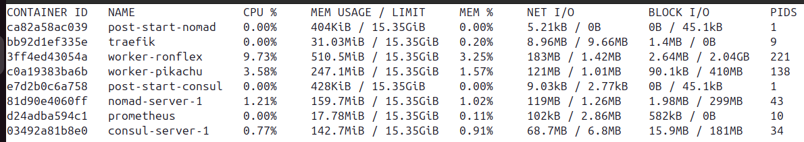

# Ministack


Ministack is a lightweight, local environment tool designed to mimic a Minikube-like experience for HashiCorp's suite of tools: **Nomad**, **Consul**, and **Vault**. It allows you to easily deploy and manage local clusters, simplifying development and testing workflows.

---

## Features

- **Local Cluster Deployment**: Quickly launch and manage local clusters for Nomad, Consul, and Vault.
- **Configuration Flexibility**: Define and manage multiple cluster configurations using YAML files.
- **Simplified CLI Commands**: Start and stop clusters effortlessly with command-line tools.

---

## Installation

To install Ministack, follow this step:

```sh
$ curl -fsSL https://raw.githubusercontent.com/gperreymond/ministack/main/install | bash
```

---

## Cluster configuration details

All default versions, are the minimum versions working with the automatic config files.

```yaml
# mandatory
name: 'my-cluster-name'
# mandatory
datacenter: 'datacenter name used for nomad/consul'

hashibase:
  repository: 'custom' # default = "ghcr.io/gperreymond/hashibase"
  tag: 'custom' # default = "base-1.1.0"

services:
  consul:
    enabled: true
    version: 'x.x.x' # default = "1.20.2"
    log_level: 'trace|debug|info|warn|error' # default = "info"
    # self-elect, should be 3 or 5 for production
    bootstrap_expect: 1 # default = 1
  nomad:
    enabled: true
    log_level: 'trace|debug|info|warn|error' # default = "info"
    version: 'x.x.x' # default = "1.9.5"
    customized:
      extra_configs: false # default = false (see "customize nomad" below in the documentation )
      extra_volumes: [] # default = [] (see "customize nomad" below in the documentation )
      tls: false # default = false (see "customize nomad" below in the documentation )
      bind_addr: '....' # default = null (see "nomad bind_add" documentation)
      retry_join: [] # default = [] (see "customize nomad" below in the documentation )
    # self-elect, should be 3 or 5 for production.
    # could be 0, i you want only clients, but you need to work on custom retry_join
    bootstrap_expect: 1 # default = 1
    clients: # default = []
      - name: 'worker-pikachu'
      - name: 'worker-ronflex'

plugins:
  traefik:
    enabled: true
    log_level: 'RACE|DEBUG|INFO|WARN|ERROR|FATAL|PANIC' # default = "INFO"
    version: 'x.x.x' # default = "3.3.1"
  prometheus:
    enabled: true
    log_level: 'info' # default = "info"
    version: 'x.x.x'  # default = "3.1.0"
    customized: false # default = false (see "customize prometheus" below in the documentation )
```

---

## Some examples

Warnings:
* stop a cluster before starting another one.
* all data will persist.

### Cluster mode "nomad only"

> Usage of __netbird__ as vpn network!

__Configuration__
* consul is disable
* nomad with replicas 3 and no clients
* nomad is in https
* vault is disable

In __examples/hashistack-single__, you will found files needed to activate nomad in https, see nomad customize section, to learn how to manage those files and directoris.

```sh
$ mkdir -p $HOME/.ministack/hashistack-single
```
Then copy the content of __examples/hashistack-single__ into  __$HOME/.ministack/hashistack-single__

```sh
# start cluster
$ ministack --config examples/nomad-only.yaml --start
# stop cluster
$ ministack --config examples/nomad-only.yaml --stop
```

### Cluster mode dev

__Configuration__
* consul with replicas 1
* nomad with replicas 1 and 2 clients
* vault is disable

```sh
# start cluster
$ ministack --config examples/nomad-with-consul.yaml --start
# stop cluster
$ ministack --config examples/nomad-with-consul.yaml --stop
```

Common urls:
* http://traefik.docker.localhost/
* http://nomad.docker.localhost/
* http://consul.docker.localhost/
* http://prometheus.docker.localhost/

You will find 3 kinds of nomad jobs in __examples/hashistack-dev/jobs__:
* one with service provider nomad
* one with service provider consul, and connect native "true"
* one with service provider consul, and connect with sidecar proxy "mesh"

```sh
$ docker stats
```


```sh
$ docker exec -it worker-ronflex docker ps
```
```txt
CONTAINER ID   IMAGE                             COMMAND                  CREATED          STATUS          PORTS     NAMES
e55be0a05ac3   busybox:1                         "httpd -v -f -p 6000…"   10 minutes ago   Up 10 minutes             web-86713971-376c-8ea4-cbc3-e31833953fe4
f1a2aad48a86   busybox:1                         "httpd -v -f -p 6000…"   10 minutes ago   Up 10 minutes             web-b450e015-627f-0ba1-72b0-427b0ff37da3
2bd4e6d176f0   envoyproxy/envoy:v1.31.2          "/docker-entrypoint.…"   10 minutes ago   Up 10 minutes             connect-proxy-hello-world-mesh-port-http-86713971-376c-8ea4-cbc3-e31833953fe4
c65140d50003   envoyproxy/envoy:v1.31.2          "/docker-entrypoint.…"   10 minutes ago   Up 10 minutes             connect-proxy-hello-world-mesh-port-http-b450e015-627f-0ba1-72b0-427b0ff37da3
feb099f4b2e7   registry.k8s.io/pause-amd64:3.3   "/pause"                 10 minutes ago   Up 10 minutes             nomad_init_b450e015-627f-0ba1-72b0-427b0ff37da3
692cb23a48b3   registry.k8s.io/pause-amd64:3.3   "/pause"                 10 minutes ago   Up 10 minutes             nomad_init_86713971-376c-8ea4-cbc3-e31833953fe4
```

---

## Customize prometheus

First you need to create those directories:
```sh
$ export CLUSTER_NAME=my-cluster-name
$ mkdir -p $HOME/.ministack/$CLUSTER_NAME/prometheus/scrape_configs
$ mkdir -p $HOME/.ministack/$CLUSTER_NAME/prometheus/rules
```

You can add your own external configs for prometheus by activated "customized" in the config file, like that:
```yaml
plugins:
  prometheus:
    enabled: true
    customized: true
```

* Now, you can add your onw rules and scrape_configs to thosee directory, see prometheus documentation.
* Prometheus reloading is automatically done every minute.

> You will find exemples in __examples/hashistack-dev/prometheus__

---

## Customize nomad

### Activate extra config files

First you need to create this directory, and those two files:
```sh
$ export CLUSTER_NAME=my-cluster-name
$ mkdir -p $HOME/.ministack/$CLUSTER_NAME/nomad
$ touch -p $HOME/.ministack/$CLUSTER_NAME/nomad/server.hcl
$ touch -p $HOME/.ministack/$CLUSTER_NAME/nomad/client.hcl
```

You can add your own external configs for nomad by activated "customized" in the config file, like that:
```yaml
services:
  nomad:
    customized:
      extra_configs: true 
```

* Changes in those two file will override the default configuration, or add new parts.
* Every time you change one of this files, you need to restart the nomad service ; To do that you just need to execute a docker command.

```sh
# this command will restart the nomad service in nomad-server-1
$ docker exec -it nomad-server-1 service nomad restart
```
Just replace the name of the container, by the one you want to restart.

### Activate another bind address

```yaml
services:
  nomad:
    customized:
      bind_addr: '{{ GetInterfaceIP \"eht1\" }}'
```

### Activate custom retry_join

```yaml
services:
  nomad:
    customized:
      retry_join:
        - "exec=/scripts/netbird-peers"
```

### Activate the extra volumes

If you need to mount volumes into nomad server and/or nomad clients, here how to process.  

First you need to create irectories:
```sh
$ export CLUSTER_NAME=my-cluster-name
$ mkdir -p $HOME/.ministack/$CLUSTER_NAME/nomad
$ mkdir -p $HOME/.ministack/$CLUSTER_NAME/nomad/first_one
$ mkdir -p $HOME/.ministack/$CLUSTER_NAME/nomad/another_one
```

```yaml
services:
  nomad:
    enabled: true
    customized:
      extra_volumes:
        - 'first_one'
    clients:
      - name: 'worker-rondoudou'
        extra_volumes:
          - 'another_one'
```

### Activate the tls for plugins

If you customize nomad to be in https, in order to have plugins prometheus and traefik working, you also need to activate this option:
```yaml
services:
  nomad:
    customized:
      tls: true
```

> Use this only if you want to use those plugins with nomad in https mode, else, it's not relevant.

---

## Some useful articles

* https://developer.hashicorp.com/nomad/docs/configuration
* https://github.com/GuyBarros/nomad_jobs
* https://romanzipp.com/blog/get-started-with-hashi-nomad-consul
* https://mrkaran.dev/posts/nomad-networking-explained
* https://last9.io/blog/mastering-prometheus-relabeling-a-comprehensive-guide
* https://samber.github.io/awesome-prometheus-alerts/rules.html

---

## Contributing

Contributions are welcome! Feel free to fork the repository and submit a pull request.

---
