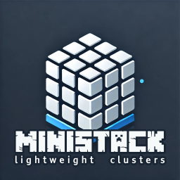

# Ministack



Ministack is a lightweight, local environment tool designed to mimic a Minikube-like experience for HashiCorp's suite of tools: **Nomad**, **Consul**, and **Vault**. It allows you to easily deploy and manage local clusters, simplifying development and testing workflows.

## Features

- **Local Cluster Deployment**: Quickly launch and manage local clusters for Nomad, Consul, and Vault.
- **Configuration Flexibility**: Define and manage multiple cluster configurations using YAML files.
- **Simplified CLI Commands**: Start and stop clusters effortlessly with command-line tools.

## Installation

To install Ministack, follow these steps:

```bash
$ curl -fsSL https://raw.githubusercontent.com/gperreymond/ministack/main/install | bash
```

## Cluster configuration details

```yaml
# mandatory
name: 'the cluster name'
# mandatory
datacenter: 'datacenter name used for nomad/consul'

hashibase:
  version: 'x.x.x' # default = "base-1.0.0"

services:
  consul:
    enabled: true
    version: 'x.x.x' # default = "1.20.1"
    log_level: 'trace|debug|info|warn|error' # default = "info"
    bootstrap_expect: 1 # default = 1
  nomad:
    enabled: true
    version: 'x.x.x' # default = "1.9.4"
    log_level: 'trace|debug|info|warn|error' # default = "info"
    bootstrap_expect: 1 # default = 1
    clients: # default = []
      - name: 'worker-pikachu'
      - name: 'worker-ronflex'

plugins:
  traefik:
    enabled: true
    
    log_level: 'RACE|DEBUG|INFO|WARN|ERROR|FATAL|PANIC' # default = "INFO"
    
    version: 'x.x.x' # default = "3.3.1"
  prometheus:
    enabled: true
    log_level: 'debug|info' # default = "info"
    version: 'x.x.x'  # default = "2.55.1"
```

## Some examples

Warnings:
* stop a cluster before starting another one.
* all data will persist.

Common urls:
* http://traefik.docker.localhost/
* http://nomad.docker.localhost/
* http://consul.docker.localhost/

### Cluster mode "nomad only"

__Configuration__
* consul is disable
* nomad with replicas 3 and one client
* vault is disable

```sh
# start cluster
$ ministack --config examples/nomad-only.yaml --start
# stop cluster
$ ministack --config examples/nomad-only.yaml --stop
```

### Cluster mode dev

__Configuration__
* consul with replicas 1
* nomad with replicas 1 and 2 clients
* vault is disable

```sh
# start cluster
$ ministack --config examples/nomad-with-consul.yaml --start
# stop cluster
$ ministack --config examples/nomad-with-consul.yaml --stop
```

You will find 3 kinds of nomad jobs in __examples/jobs__:
* one with service provider nomad
* one with service provider consul, and connect native "true"
* one with service provider consul, and connect with sidecar proxy "mesh"

```sh
$ docker stats
```


```sh
$ docker exec -it worker-ronflex docker ps
```
```txt
CONTAINER ID   IMAGE                             COMMAND                  CREATED          STATUS          PORTS     NAMES
e55be0a05ac3   busybox:1                         "httpd -v -f -p 6000…"   10 minutes ago   Up 10 minutes             web-86713971-376c-8ea4-cbc3-e31833953fe4
f1a2aad48a86   busybox:1                         "httpd -v -f -p 6000…"   10 minutes ago   Up 10 minutes             web-b450e015-627f-0ba1-72b0-427b0ff37da3
2bd4e6d176f0   envoyproxy/envoy:v1.31.2          "/docker-entrypoint.…"   10 minutes ago   Up 10 minutes             connect-proxy-hello-world-mesh-port-http-86713971-376c-8ea4-cbc3-e31833953fe4
c65140d50003   envoyproxy/envoy:v1.31.2          "/docker-entrypoint.…"   10 minutes ago   Up 10 minutes             connect-proxy-hello-world-mesh-port-http-b450e015-627f-0ba1-72b0-427b0ff37da3
feb099f4b2e7   registry.k8s.io/pause-amd64:3.3   "/pause"                 10 minutes ago   Up 10 minutes             nomad_init_b450e015-627f-0ba1-72b0-427b0ff37da3
692cb23a48b3   registry.k8s.io/pause-amd64:3.3   "/pause"                 10 minutes ago   Up 10 minutes             nomad_init_86713971-376c-8ea4-cbc3-e31833953fe4
```

## Customize your own configurations for nomad, consul and/or vault

...

## Some useful articles

* https://romanzipp.com/blog/get-started-with-hashi-nomad-consul
* https://mrkaran.dev/posts/nomad-networking-explained

